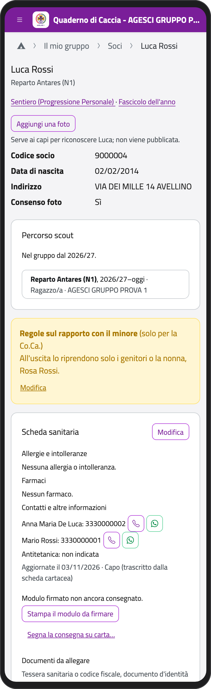
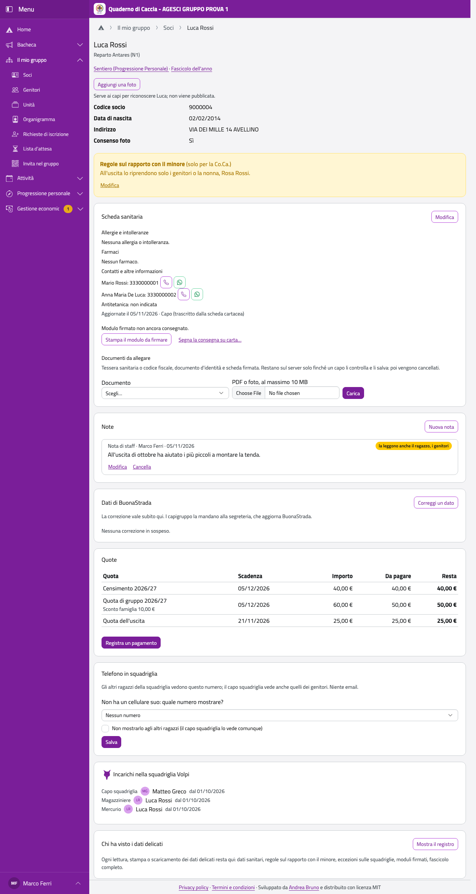
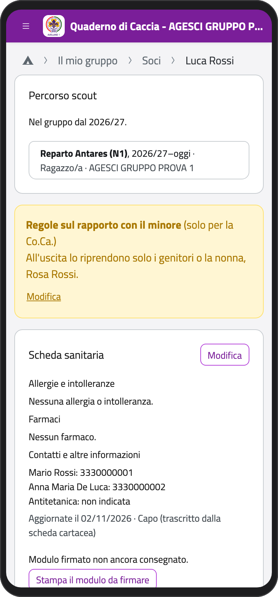
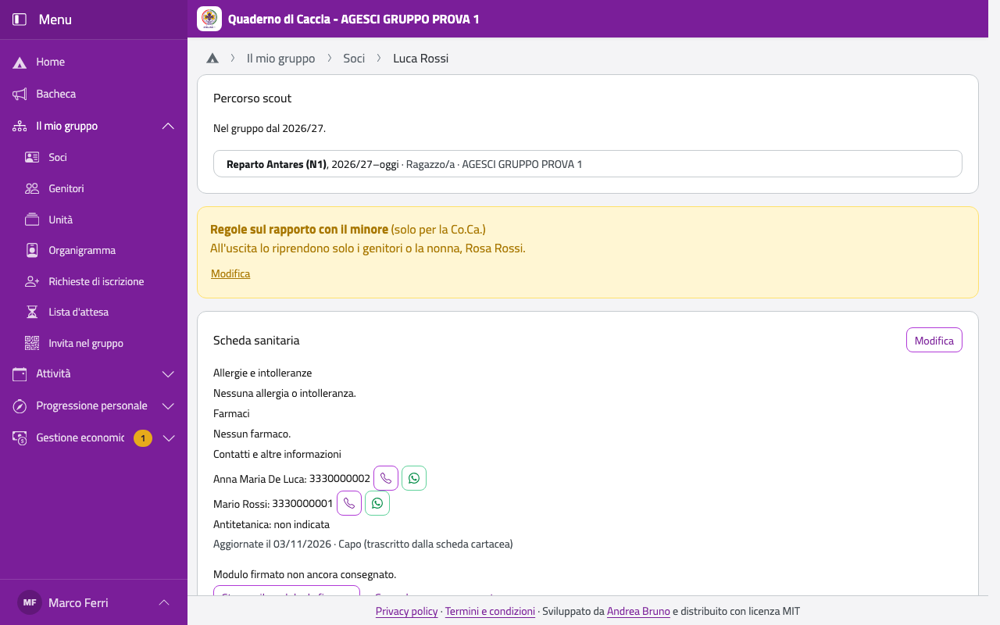
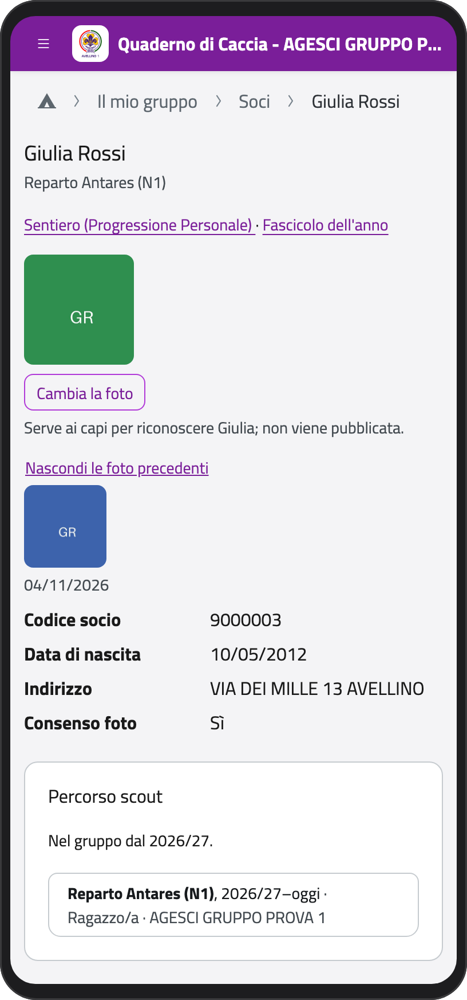
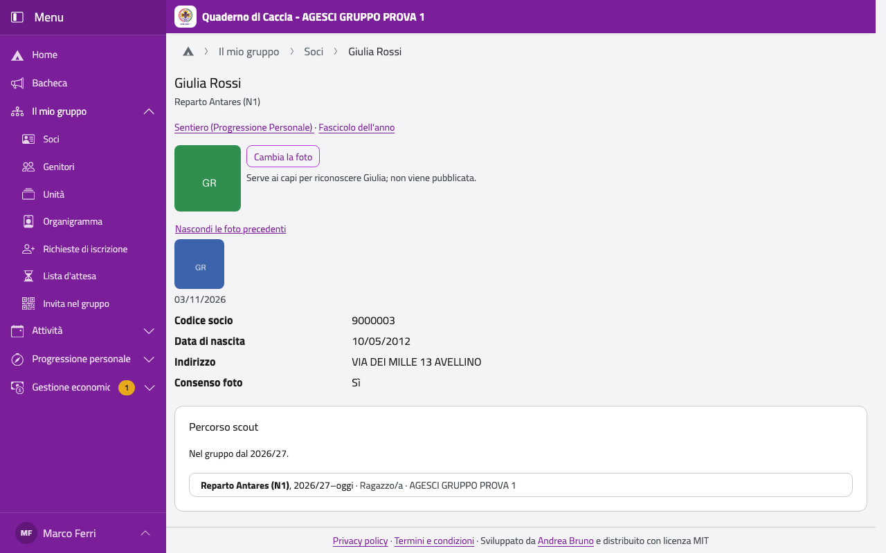
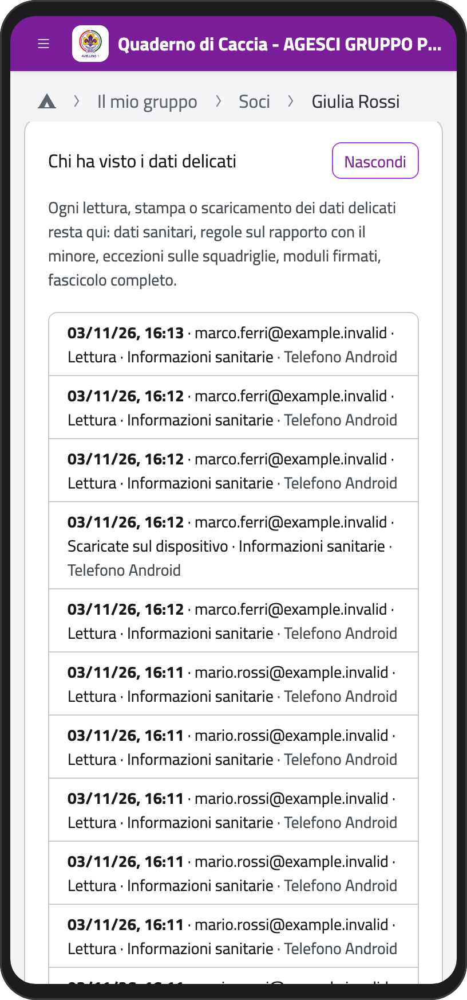
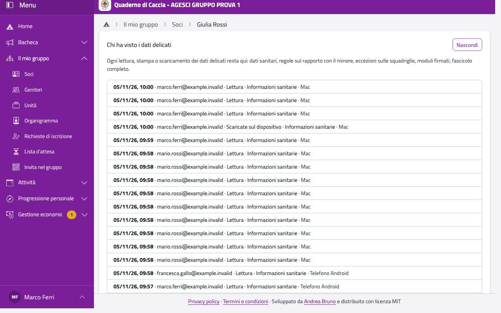
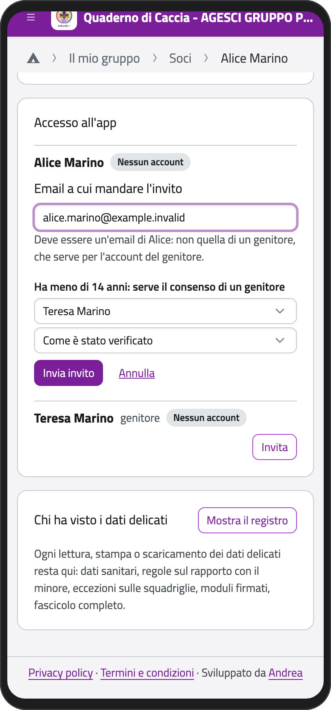
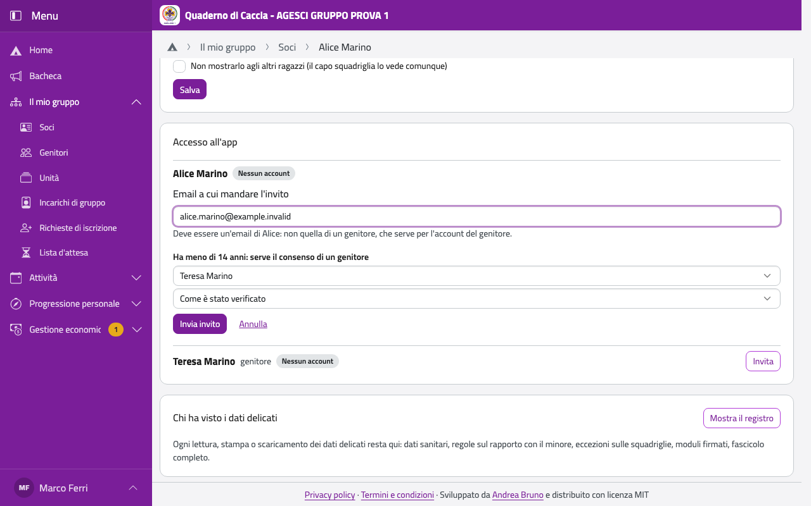

# Soci e genitori

Nella Home, in **Il mio gruppo**, tocca **Soci** per i capi e i ragazzi censiti, oppure
**Genitori** per chi ha la responsabilità genitoriale dei ragazzi. In tutte e due scegli
un'unità (in **Genitori**: i genitori dei ragazzi di quell'unità) o cerca per nome, poi
tocca una persona per aprire la sua scheda. Un capo che è anche genitore è in tutte e due.

Nella scheda trovi, nell'ordine: i collegamenti alla Progressione e al fascicolo dell'anno,
la foto, i dati di BuonaStrada, il percorso scout, le regole sul rapporto con il minore, la
scheda sanitaria, le note, le quote, il telefono in squadriglia e l'accesso all'app.

:::{container} schermate
{.telefono width="30%"}
{.computer width="65%"}
:::

## Correggere un dato di BuonaStrada

Se un dato è sbagliato, correggilo come fa un genitore (vedi [Correggere un
dato](../genitore/figli.md#correggere-un-dato-di-buonastrada)): vale subito nell'app, e i
capigruppo lo mandano alla segreteria. Per i ragazzi della tua unità puoi correggere quasi
tutto, anche il sesso e il luogo di nascita; nome, cognome, data di nascita e codice fiscale
li correggono solo i capigruppo.

La **professione**, che arriva da BuonaStrada, la vedono solo la persona stessa e i capi; si
corregge scegliendola dall'elenco di BuonaStrada.

## Il percorso scout

Il riquadro **Percorso scout** elenca tutti i periodi della persona, da ragazzo e da capo,
uno per riga con l'unità, gli anni e il gruppo, e da quando è nel gruppo. I periodi nel
nostro gruppo vengono da BuonaStrada e dall'app; quelli in un altro gruppo da BuonaStrada,
quando l'esportazione li ha (per esempio per chi è arrivato da un altro gruppo). Lo vedono
i capi, la persona stessa e i genitori di un minore.

Gli anni che mancano (prima di BuonaStrada, o in un gruppo che l'esportazione non porta) li
aggiunge un capogruppo, o il capo stesso nel suo percorso: tocca **Aggiungi un periodo**,
scrivi l'unità, il gruppo (vuoto se era il nostro), se era ragazzo o capo e gli anni
(quello in cui finiscono: 2014/15 è 2015), poi **Salva**. Questi periodi sono segnati come
«ricostruito» e si tolgono con **Togli**.

:::{container} schermate
{.telefono width="30%"}
{.computer width="65%"}
:::

## La foto

La foto serve a riconoscere il ragazzo, per esempio nelle iscrizioni su BuonaCaccia. Per i
ragazzi della tua unità tocca **Aggiungi una foto** (o **Cambia la foto**), ritaglia in
modo che nel riquadro ci sia solo lui o lei e tocca **Salva la foto**. Le foto precedenti
restano per i capi: tocca **Foto precedenti** per vederle, con la data.

:::{container} schermate
{.telefono width="30%"}
{.computer width="65%"}
:::

## Il telefono in squadriglia

Per un esploratore o una guida senza cellulare, in **Telefono in squadriglia** puoi
scegliere quale numero vedono gli altri, come fanno i genitori (vedi [Telefono in
squadriglia](../genitore/squadriglia)).

## Invitare qualcuno nell'app

Gli inviti li mandano il capo unità e i capigruppo.

1. Nella scheda, in **Accesso all'app**, accanto alla persona (o a un genitore) tocca
   **Invita**.
2. Scrivi l'email **della persona**: un ragazzo non si invita con l'email di un genitore.
3. Se ha meno di 14 anni serve il consenso di un genitore: scegli chi l'ha dato e come
   l'hai verificato (dall'account del genitore, in presenza davanti a un capo, con un modulo
   firmato).
4. Tocca **Invia invito**.

L'invito vale 14 giorni; finché non viene usato lo puoi **annullare**.

## Chi ha visto i dati delicati

In fondo alla scheda, **Chi ha visto i dati delicati** è il registro di ogni lettura, stampa
o scaricamento dei suoi dati delicati: dati sanitari, regole sul rapporto con il minore,
eccezioni sulle squadriglie, moduli firmati, fascicolo completo. Tocca **Mostra il
registro**: per ognuno vedi quando, chi, cosa ha fatto e da quale dispositivo. Lo vedono i
capi; ai genitori, se lo chiedono, lo mostrano i capigruppo (è anche nel fascicolo completo).

:::{container} schermate
{.telefono width="30%"}
{.computer width="65%"}
:::

:::{container} schermate
{.telefono width="30%"}
{.computer width="65%"}
:::
